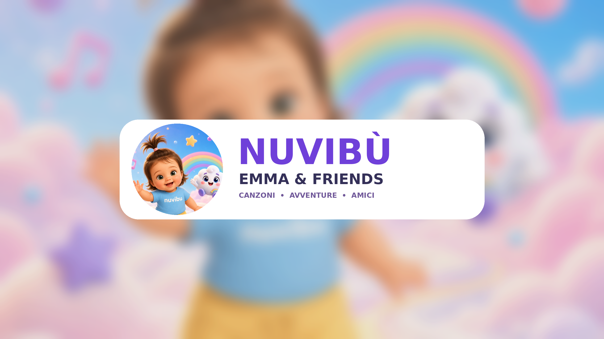
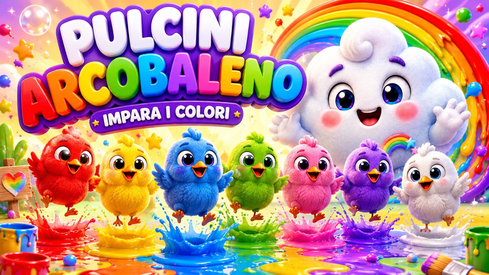

# Nuvibù Studio



Console autonoma per progettare, produrre, revisionare e misurare **canzoni e cartoni originali per un canale YouTube made-for-kids**. Il progetto non è collegato a British Institutes o Digital Campus.

L’identità pubblica è **Nuvibù** e la serie principale è **Emma & Friends**. Emma, cartoonizzata dalle reference familiari approvate, è la protagonista fissa di ogni episodio; la nuvola Nuvi è la sua spalla ricorrente. La Character Bible blocca volto, silhouette, outfit e gerarchia del cast. Nome, handle e marchio devono comunque essere verificati prima del lancio pubblico.

## Stato del progetto

### Implementato

- brief episodio con età, tema, hook, parole target, durata, BPM e ritmo visivo;
- bozza originale di testo e metadati;
- varianti musicali e adattatore ElevenLabs Music;
- storyboard automatico in scene;
- adattatore Google Veo dual backend (Gemini API o Vertex AI) con character reference;
- modalità mock offline e senza crediti;
- montaggio FFmpeg 16:9;
- Short verticale 9:16;
- thumbnail, QC e approvazione umana;
- asset ledger con provider, modello, variante, costo e file;
- upload YouTube inizialmente privato e marcato `made for kids`;
- raccolta metriche e Growth Lab;
- SQLite locale, PostgreSQL/Neon in produzione;
- worker separato per i job lunghi;
- login amministratore con sessione firmata e cookie sicuro in produzione;
- approvazioni separate di testo e storyboard prima di usare provider a pagamento;
- conferma esplicita del costo per musica e render;
- ripresa delle operazioni Veo e ledger incrementale per evitare duplicazioni di costo;
- deploy ripetibile su Cloud Run con service account separati.

### Da validare con gli account reali

- generazione musicale con la chiave del provider;
- generazione video con il progetto Google effettivo;
- consistenza di Emma e degli amici su un episodio completo;
- OAuth, upload e Analytics del canale YouTube;
- costi reali per episodio;
- disponibilità legale del nome Nuvibù.

## Direzione visiva

| Asset | Percorso |
|---|---|
| Avatar canale | `brand/nuvibu-avatar-800.png` |
| Banner YouTube | `brand/nuvibu-youtube-banner-2560x1440.png` |
| Key art Emma & Friends | `brand/source/nuvibu-key-art.png` |
| Reference ufficiale Emma | `brand/source/emma-character-sheet.png` |
| Reference Nuvi, la nuvola | `brand/source/nuvi-cloud-key-art.png` |
| Concept “Pulcini Arcobaleno” | `brand/concepts/pulcini-arcobaleno.png` |
| Concept “Cucù dietro la nuvola” | `brand/concepts/cucu-dietro-la-nuvola.png` |
| Character Bible | `data/character_bible_template.json` |



La modalità mock usa queste immagini approvate per creare preview animate con pan e zoom. È un test della pipeline, **non un sostituto della generazione video live**.

## Pipeline

```text
Brief
  → testo e metadati
  → revisione e approvazione testo
  → storyboard
  → revisione e approvazione storyboard
  → conferma costo e musica
  → reference ufficiale Emma + amici + mondo
  → conferma costo e scene AI
  → scene AI con Emma obbligatoria come image 1
  → video 16:9
  → Short 9:16 + thumbnail
  → QC automatico
  → approvazione umana
  → upload privato YouTube
  → revisione in YouTube Studio
  → Analytics e nuovo esperimento
```

## Avvio rapido senza chiavi API

Requisiti: Python 3.11+, FFmpeg e `pip`.

```bash
cp .env.example .env
python -m pip install -r requirements-dev.txt
python scripts/seed_demo.py --render
uvicorn app.main:app --host 0.0.0.0 --port 8000
```

Aprire `http://localhost:8000`.

Il mock genera musica strumentale originale e una preview in movimento da concept approvati. Ogni frame porta l'indicazione **PREVIEW TECNICA • NON PUBBLICARE**.

## Attivare i provider live

```dotenv
PROVIDER_MODE=live

ELEVENLABS_API_KEY=...
ELEVENLABS_MUSIC_MODEL=music_v2

VEO_BACKEND=vertex
VEO_MODEL=veo-3.1-generate-001
GOOGLE_CLOUD_PROJECT=nuvibu
GOOGLE_CLOUD_LOCATION=us-central1
VEO_OUTPUT_GCS_URI=gs://nome-bucket/veo-output/
```

Vertex su Cloud Run usa automaticamente l'identità del servizio (Application
Default Credentials): non servono né una chiave Gemini né una chiave JSON
permanente. La chiave ElevenLabs va in Secret Manager e soltanto nel worker.
Nessun segreto deve entrare nel repository o nell'immagine container.

Gemini Developer API resta disponibile come backend opzionale esplicito:

```dotenv
VEO_BACKEND=gemini
VEO_MODEL=veo-3.1-fast-generate-preview
GEMINI_API_KEY=...
```

Anche la chiave Gemini opzionale va salvata in Secret Manager, mai nel
repository o nell'immagine.

### Guardrail costi

```dotenv
MAX_ESTIMATED_COST_USD_PER_EPISODE=40
MAX_DAILY_ESTIMATED_COST_USD=40
MAX_MUSIC_VARIANTS=1
MAX_SCENE_RETRIES=0
```

La pipeline interrompe il job quando la stima supera il tetto per episodio o
quello giornaliero. Cloud Run consente episodi fino a 180 secondi e mantiene un
tetto di 40 USD per episodio e 40 USD al giorno. Il formato editoriale
consigliato parte da 75 secondi. Musica e render partono soltanto dopo una
conferma esplicita nella console. I costi registrati vanno riconciliati con i
pannelli dei provider. Il limite giornaliero comprende anche la spesa prenotata
dai job attivi; un esito provider ambiguo conserva job e prenotazione finché la
stessa operazione non viene ripresa o riconciliata.

## Collegare YouTube

1. Creare il canale dall'account Google proprietario.
2. Abilitare YouTube Data API e YouTube Analytics API.
3. Creare credenziali OAuth.
4. Salvare il client JSON come `secrets/youtube-client-secret.json`.
5. Eseguire:

```bash
python scripts/youtube_auth.py
```

6. Approvare l'episodio nella console.
7. Caricarlo come privato.
8. Controllare integralmente video, audio, thumbnail, audience e metadati in YouTube Studio.
9. Programmare o rendere pubblico manualmente.

## Worker

```bash
python scripts/run_worker.py
```

Una sola esecuzione:

```bash
python scripts/run_worker.py --once
```

In produzione il worker acquisisce un singolo job PostgreSQL con locking
`SKIP LOCKED`; ogni esecuzione Cloud Run Job riceve l'ID esatto del job e usa
`--once`. Operazioni e asset già completati vengono ripresi invece di rigenerati.

## Deploy Cloud Run

Nel progetto Google Cloud `nuvibu`:

```bash
./deploy/cloud-run.sh
```

Il comando usa Vertex AI, `us-central1`, ADC e
`veo-3.1-generate-001`. Per selezionare esplicitamente il backend Gemini:

```bash
VEO_BACKEND=gemini ./deploy/cloud-run.sh
```

La procedura completa, inclusi nomi dei segreti e verifica finale, è in
[`docs/DEPLOYMENT.md`](docs/DEPLOYMENT.md).

## Test

```bash
pytest
python -m compileall app scripts tests
```

I test coprono autenticazione, approvazioni editoriali, guardrail di spesa,
ripresa sicura dei job, integrità media e pipeline mock completa con render,
Short, thumbnail e report QC.

## Docker

```bash
cp .env.example .env
docker compose up --build
```

## Struttura

```text
app/        FastAPI, UI, provider e pipeline
brand/      avatar, banner, key art e concept
data/       profilo canale, Character Bible e piano editoriale
 demo/      output tecnico portabile
 docs/      lancio, deployment e checklist
 scripts/   seed, worker, OAuth e derivazione asset
 tests/     test automatici
```

## Limiti dichiarati

- Il progetto non copia testi, melodie, personaggi, grafiche o titoli di altri canali.
- Nessun algoritmo garantisce visualizzazioni o monetizzazione.
- Il QC automatico verifica struttura e regole, non sostituisce la revisione umana.
- I concept inclusi definiscono la qualità visiva, ma la consistenza seriale richiede reference bloccate o un rig/modello dedicato.
- La pubblicazione automatica in pubblico resta disabilitata per scelta progettuale.
